# 🎅 SecretSanta-2025 🎄

<div align="center">


*A magical, full-stack gift exchange platform.*
*Featuring Real-time Chat, Mini-Games, and a Admin Console.*

❄️ **[ [LAUNCH APPLICATION](https://secretsanta-2025.web.app) ]** ❄️

</div>

---

## 🎁 How It Works

This application manages the entire Secret Santa lifecycle, from registration to the final reveal!

### 1. 🦌 For Participants (The User)
- **Login**: Use your NIT Trichy Webmail via Delta Auth (SSO) or standard email.
- **Dashboard**: A "Winter Wonderland" interface with falling snow and serial lights.
- **Tasks & Games**: Complete daily tasks (upload photos, answer quizzes) and play games (Tic-Tac-Toe, Memory Game) to earn points.
- **Leaderboard**: Compete with others for the top spot!
- **Chat**: Discuss anonymously (or not) in the global chat.
- **The Reveal**: On the special day, click the card to reveal your Giftee!

### 2. 👨‍💻 For Admins (The "Hacker" Console)
- **Hacker Theme**: A stark contrast to the user view—Dark Mode, Neon Green text, Terminal font.
- **Control Center**: Manage users, pairings, and game settings.
- **Task Builder**: Create new daily/bonus tasks with a drag-and-drop style builder.
- **Live Logs**: Watch user activity stream in real-time.

---

## � System Architecture & Flow

### 👤 User Workflow


### 👨‍💻 Admin Workflow

```mermaid
graph TD
    A[Admin Login] --> B[Hacker Console Access]
    
    subgraph "🖥️ Admin Terminal"
        B --> C[User Management]
        B --> D[Task Builder]
        B --> E[Pairing Engine]
        B --> F[System Settings]
    end
    
    C -->|Ban/Delete| G[User DB]
    D -->|Create| H[New Tasks]
    E -->|Algorithm| I[Generate Pairs]
    F -->|Toggle| J[Game Modules]
```


---

## 🎨 UI Design "Photos" (Concept)

Since we can't embed real-time screenshots in a markdown file easily, here is a visual representation of the UI vibe!

### **User View: Winter Wonderland**
```text
+--------------------------------------------------+
|  🎅 Secret Santa                   [Profile] [x] |
|  ~~~~~~~~~~~~~~~~~~~~~~~~~~~~~~~~~~~~~~~~~~~~~~~ |
|  [  SNOW FALLING ANIMATION   *     *      *    ] |
|                                                  |
|  +----------------+  +------------------------+  |
|  |   YOUR POINTS  |  |    DAYS TO GIFTING     |  |
|  |      250 🏆    |  |          05 📅         |  |
|  +----------------+  +------------------------+  |
|                                                  |
|  > TODAY'S TASKS:                                |
|  [x] Upload Reindeer Selfie (+10pts)             |
|  [ ] Sing Jingle Bells (Bonus)                   |
|                                                  |
|  > MINI GAMES:                                   |
|  [ Tic-Tac-Toe ]  [ Memory Game ]  [ Mollywood ] |
+--------------------------------------------------+
```

### **Admin View: Hacker Console**
```text
+--------------------------------------------------+
|  >_ ADMIN_CONSOLE_v2.0               [EXIT]      |
|  ----------------------------------------------- |
|  > SYSTEM_STATUS: [ONLINE]                       |
|  > ACTIVE_USERS: 142                             |
|                                                  |
|  +----------------+  +------------------------+  |
|  | >_ ERROR_LOGS  |  | >_ CONTROL_PANEL       |  |
|  | No errors...   |  | [GENERATE_PAIRS]       |  |
|  | All systems go.|  | [FLUSH_REDIS_CACHE]    |  |
|  |                |  | [TOGGLE_MAINTENANCE]   |  |
|  +----------------+  +------------------------+  |
|                                                  |
|  >_ LATEST_ACTIVITY:                             |
|  [10:42] User 'Santa' completed Task #42         |
|  [10:45] New Registration: 'Elf_01'              |
+--------------------------------------------------+
```

---

## 🚀 Quick Start Guide

### 1. Setup
```bash
# Clone
git clone https://github.com/your-repo/SecretSanta-2025.git
cd SecretSanta-2025

# Install
pnpm install

# Setup Env
cp .env.example .env
# (Fill in Supabase & DeltaAuth keys)
```

### 2. Database
Run the SQL scripts in `database/archive` (start with `COMPLETE_DB_SETUP.sql`) in your Supabase SQL Editor.

### 3. Run
```bash
pnpm dev
```
Visit `http://localhost:5174` and enjoy!

---

## 📦 Deployment (Summary)

**Recommended**: Google Cloud Run (Serverless)

1. **Configure**: Update `.env` and `deploy_gcp.sh`.
2. **Deploy**:
   ```bash
   chmod +x scripts/deployment/deploy_gcp.sh
   ./scripts/deployment/deploy_gcp.sh
   ```
3. **Verify**: Update your Delta Auth Redirect URI to the new Cloud Run URL.

*(See `docs/` folder for legacy detailed guides if needed, though this README is the single source of truth now!)*

---

🌟 *Made with ❤️ HarishAnnavisamy" 🌟
