```text
.  *    .        .      .       .      *     .      .  
   .       *    .    *      .    _     .      *   .
      *   .    .   .     .     _( )_    .      .   
 .  .   __________  .  *      (_(%)_)     .    *  .
     | S E C R E T |      .     (_)\      *     .
 *   |  S A N T A  | .        .     |  .      .    .
  .  |_____________|    *   .      |     .      * 
```

# 🎅 Secret Santa 2025: NITT 🎄

<div align="center">


<br/>

### [🚀 **Launch App**](https://secretsantanitt25.site/) &nbsp; • &nbsp; [📚 **Tech Documentation**](https://secretsantanitt25.site/tech-docs)

<br/>

<div align="center">
  
  <br/><br/>
  
  <br/><br/>
  
</div>

</div>

---

##  Project Overview

**Secret Santa 2025** is a highly interactive, gamified, and secure web application designed for the NIT Trichy community to celebrate the holiday season. Unlike traditional assignment scripts, this platform offers a comprehensive suite of features including **algorithmic pairing**, **anonymous messaging**, **real-time multiplayer games** (Tic-Tac-Toe, Beat the Grinch), and a **feature-rich Admin Dashboard**.

The system is built on a **Hybrid Split-Container Architecture**, leveraging the best of Relational (PostgreSQL) and Document (MongoDB) databases to ensure data integrity and real-time performance.

---

##  Technology Stack

We use a curated stack of modern technologies, organized by their role in our split-container architecture.

###  Frontend (The Sleigh)
| Tech | Role | Description |
| :--- | :--- | :--- |
| **React 18** <br>  | **Library** | Component-based UI with Virtual DOM for snappy performance. |
| **TypeScript** <br>  | **Language** | Static typing to prevent runtime errors (like "undefined" gifts). |
| **TailwindCSS** <br>  | **Styling** | Utility-first CSS for our "Neo-Brutalist" Christmas theme. |
| **Vite** <br>  | **Build Tool** | Lightning-fast HMR and optimized production bundles. |

### Backend (The Elf Workshop)
| Tech | Role | Description |
| :--- | :--- | :--- |
| **Node.js** <br>  | **Runtime** | Event-driven, non-blocking I/O runtime. |
| **Express.js** <br>  | **Framework** | Minimalist web framework for API routes and middleware. |
| **Nginx** <br>  | **Server** | High-performance reverse proxy and static file server. |

### 🗄️ Data Layer (The Naughty/Nice List)
| Tech | Role | Description |
| :--- | :--- | :--- |
| **Supabase** <br>  | **Provider** | BaaS for PostgreSQL, Auth, and Realtime subscriptions. |
| **PostgreSQL** <br>  | **RDBMS** | Relational DB for User Profiles, Pairings, and Tasks. |
| **DeltaAuth** <br>  | **Auth** | Custom OAuth provider for NIT Trichy student verification. |

### ☁️ DevOps (The Reindeer)
| Tech | Role | Description |
| :--- | :--- | :--- |
| **Google Cloud** <br>  | **Hosting** | Serverless Cloud Run (Region: asia-south1). |
| **Docker** <br>  | **Container** | Consistent environment from Dev to Prod. |
| **Bash** <br>  | **Scripting** | Automated deployment pipelines. |

---

## 🕯️ The Secret Santa Journey

A complete walkthrough of the user experience, from the first snowflake to the final gift.

```mermaid
graph LR
    Login([🔐 Login]) --> Waiting{⏳ Waiting Phase}
    
    Waiting -->|Admin Pairs Users| Active[🎅 Active Phase]
    
    subgraph "Active Phase (2 Weeks)"
        Active --> SeeTarget[🎯 View Giftee]
        Active --> AnonChat[💬 Chat with Target]
        Active --> Tasks[📝 Daily Tasks]
        Active --> Games[🎮 Play Games]
        Tasks --> Points[🪙 Earn Points]
        Games --> Points
    end
    
    Active -->|Reveal Day| Reveal([🎁 The Reveal])
    Reveal --> Leaderboard([🏆 Final Ceremony])
```



### ❄️ Phase 1: The Gathering (Login)
Users log in using **DeltaAuth** (NIT Trichy Student ID). They create a profile, choose a fun avatar, and fill out their "Preferences" (Likes/Dislikes) so their future Santa knows what to get them.

### ❄️ Phase 2: The Elves' Work (Pairing)
Admins execute the **Derangement Algorithm**.
*   All valid users are shuffled.
*   A directed graph is created: `A -> B -> C -> A`.
*   System ensures `User != Target`.

### ❄️ Phase 3: The Festivities (Active Game)
*   **Giftee Reveal**: Users log in to see *who* they are buying for (but not who is buying for *them*).
*   **Anonymous Chat**: Santa can message their target to ask for specifics (e.g., "Do you like Dark Chocolate?") without revealing their identity.
*   **Points Race**: Users complete daily tasks ("Take a selfie with a Reindeer") and play games to top the leaderboard.

### ❄️ Phase 4: The Unwrapping (Reveal)
On the final day (admin trigged), the "Reveal" screen unlocks.
*   Users finally see who their Secret Santa was.
*   A physical meetup is organized for gift exchange.

---

## 🧩 System Features

### 🏆 Leaderboard & Economy
The competitive element driven by "Points".
*   **Scoring**: Earn points by winning games, completing "Bad Descriptions", or fulfilling Daily Tasks.
*   **Maintenance**: Admins can reset scores or ban users who exploit bugs.
*   **Ranking**: Real-time sorting based on total points.

### 💬 Communication Channels
Dual-layer messaging for privacy and community.
*   **Global Chat**: Public room for all batchmates to banter.
*   **Santa Chat**: **Anonymous** 1-on-1 channel. Santa can message their Target without revealing their identity.

### 🛡️ Admin God Mode
Complete control over the game state.
*   **Maintenance Mode**: Lock the app for updates.
*   **Force Reveal**: Trigger the final event where everyone sees their Santa.
*   **User Management**: Ban/Unban, Edit Profiles, Reset Passwords.

---

## 📂 Project Structure

A closer look under the hood of our winter engine.

```file-tree
# ❄️ Secret Santa Project Root
.
├── 📂 backend/                     # 🦌 The Logic Center (Node.js)
│   ├── 📄 server.mjs               # Main Express App & Routes
│   ├── 📄 Dockerfile               # Backend Container Definitions
│   └── 📄 package.json             # Dependencies (Express, Supabase-js, Mongoose)
│
├── 📂 frontend/                    # 🛷 The Visual Interface (React)
│   ├── 📂 public/                  # Static Snowflakes & Manifests
│   ├── 📂 src/
│   │   ├── 📂 components/
│   │   │   ├── 📂 admin/           # 🛡️ God Mode Dashboard
│   │   │   ├── 📂 games/           # 🎮 TicTacToe, Flappy Santa, Bad Description
│   │   │   ├── 📂 features/        # 🧩 Chat, Profile, Notifications
│   │   │   └── 📂 common/          # 🎨 Reusable Christmas UI Elements
│   │   ├── 📂 contexts/            # 🧠 Global State (Auth, Theme)
│   │   ├── 📂 lib/                 # 🔌 API Connectors (Supabase, Fetch Wrappers)
│   │   └── 📄 App.tsx              # Main Router & Layout
│   └── 📄 Dockerfile               # Multi-stage Nginx Build
│
├── 📂 database/                    # 📜 The Sacred Texts (SQL)
│   └── 📄 FINAL_FIX_V3.sql         # Core Schema & Tables
│
└── 📄 deploy_gcp.sh                # 🚀 One-Click Deploy Script
```

---

## 🚀 Setup & Deployment

1.  **Install Dependencies**: `npm install` in both `frontend` and `backend`.
2.  **Env Setup**: Copy `.env.example` to `.env` and fill in Supabase/DeltaAuth keys.
3.  **Run Locally**:
    *   Backend: `cd backend && npm run dev`
    *   Frontend: `cd frontend && npm run dev`
4.  **Deploy**: Run `./deploy_gcp.sh` to build containers and push to Cloud Run.

---

## 🎅 Credits

Built with ❄️, ☕, and a lot of 🍪 by **HarishAnnavisamy!!**.


